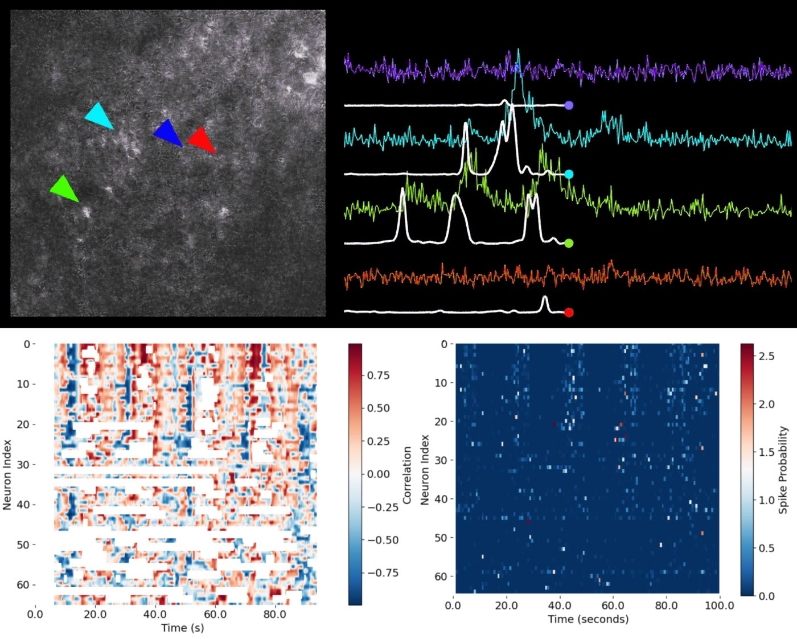

# Functional Imaging Data Analysis in Neuroscience: From Calcium Signals to Population Dynamics

In [this course](https://www.fabriziomusacchio.com/teaching/teaching_functional_image_data_analysis/), students will learn essential computational approaches for analyzing functional imaging data in neuroscience. The focus is on the full workflow: quantitative processing of calcium imaging data, inference of neuronal spiking activity, and the integration of behavioral measurements with neuronal activity. All analyses are based on open-source Python tools (CaImAn, CASCADE), and the course emphasizes practical, reproducible methods that do not require advanced programming skills.

**Figure: From calcium imaging to functional population analysis.** – **Upper left:** Example two-photon calcium imaging frame showing the neuropil and several identified neuronal somata (indicated by colored arrowheads: cyan, blue, red, and green). –  **Upper right:** Extracted calcium fluorescence traces ($\Delta F/F$) for the neurons marked in the image, with their corresponding **inferred spike probabilities** (white lines) overlaid. Each color corresponds to a cell indicated by the matching arrowhead. This panel illustrates how raw imaging data is converted to fluorescence traces, and how computational methods extract spike timing information from noisy signals. – **Lower right:** Matrix of **spike probability estimates** for all recorded neurons over time. Each row corresponds to a neuron, and each column to a time point, visualizing the temporal evolution of activity across the neuronal population (network activity). –  **Lower left:** Correlation matrix showing, for each neuron and time point, the **correlation between single-neuron activity and the population (network) response**. Red denotes positive correlation, blue denotes negative correlation, and white indicates uncorrelated activity or missing data. Together, these panels illustrate the workflow from raw calcium imaging, through spike inference, to the visualization and functional analysis of neural population dynamics. Source of upper panel images: [CASCADE GitHub repository](https://github.com/HelmchenLabSoftware/Cascade/tree/master) (license: MIT License)

## Learning outcomes
Upon successful completion, students will be able to:

* **Understand the principles and workflow of functional calcium imaging data analysis in neuroscience**
  * Explain the rationale for using calcium imaging and its advantages and limitations for studying neuronal population dynamics.
* **Process and analyze calcium imaging data using CaImAn**
  * Perform motion correction, segmentation, and extraction of fluorescence signals from raw calcium imaging data.
  * Apply quantitative quality control and data visualization methods to extracted traces.
* **Infer neuronal spiking activity from calcium imaging signals using CASCADE**
  * Understand the challenges and approaches for inferring action potentials from slow calcium dynamics.
  * Apply the CASCADE pipeline to convert calcium traces into estimated spike trains and evaluate inference accuracy.
* **Analyze and interpret neural population activity**
  * Visualize and quantify population activity using heatmaps, binning, and summed activity traces.
  * Apply correlation and dimensionality reduction techniques to uncover patterns and functional structure.
  * Sort and cluster neurons based on their relationship to population-level signals.
  * Identify functional assemblies and emergent collective dynamics within neural circuits.
* **Critically evaluate the limitations, sources of error, and reproducibility of each analysis step**
  * Identify common pitfalls in calcium imaging analysis and spike inference.
  * Document and reproduce analysis workflows using recommended open-source tools.

## Acknowledgements
Sample data used in this course include:
* **CaImAn sample calcium imaging data:** Example datasets are provided by the CaImAn project (Giovannucci et al., *eLife*, 2019) and are available through the official [CaImAn GitHub repository](https://github.com/flatironinstitute/CaImAn){{site.data.scuts.extlink}}. Please refer to the repository for detailed licensing and citation information.
* **CASCADE sample traces:** Example datasets and ground truth traces are provided by the CASCADE project (Giovannucci et al., *Nature Methods*, 2020) and are available via the official [CASCADE repository](https://github.com/HelmchenLabSoftware/Cascade/tree/master){{site.data.scuts.extlink}}. Refer to the repository and associated publications for further details.

We gratefully acknowledge the original authors and maintainers of CaImAn and CASCADE for making their sample data publicly available for educational and research purposes.

## License
The material provided in this course is licensed under the [Creative Commons Attribution-NonCommercial-ShareAlike 4.0 International License](https://creativecommons.org/licenses/by-nc-sa/4.0/){{site.data.scuts.extlink}}. This license allows you to share and adapt the material for non-commercial purposes, provided you give appropriate credit, indicate if changes were made, and distribute your contributions under the same license.